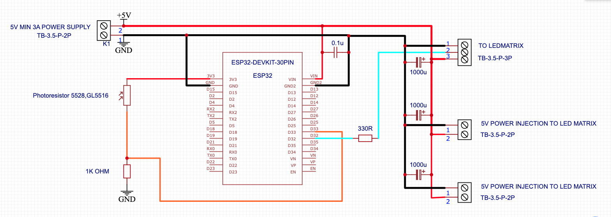
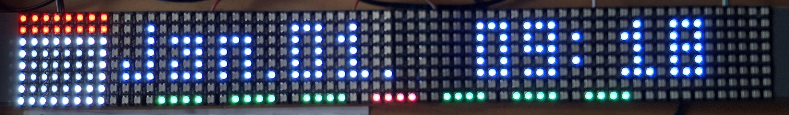
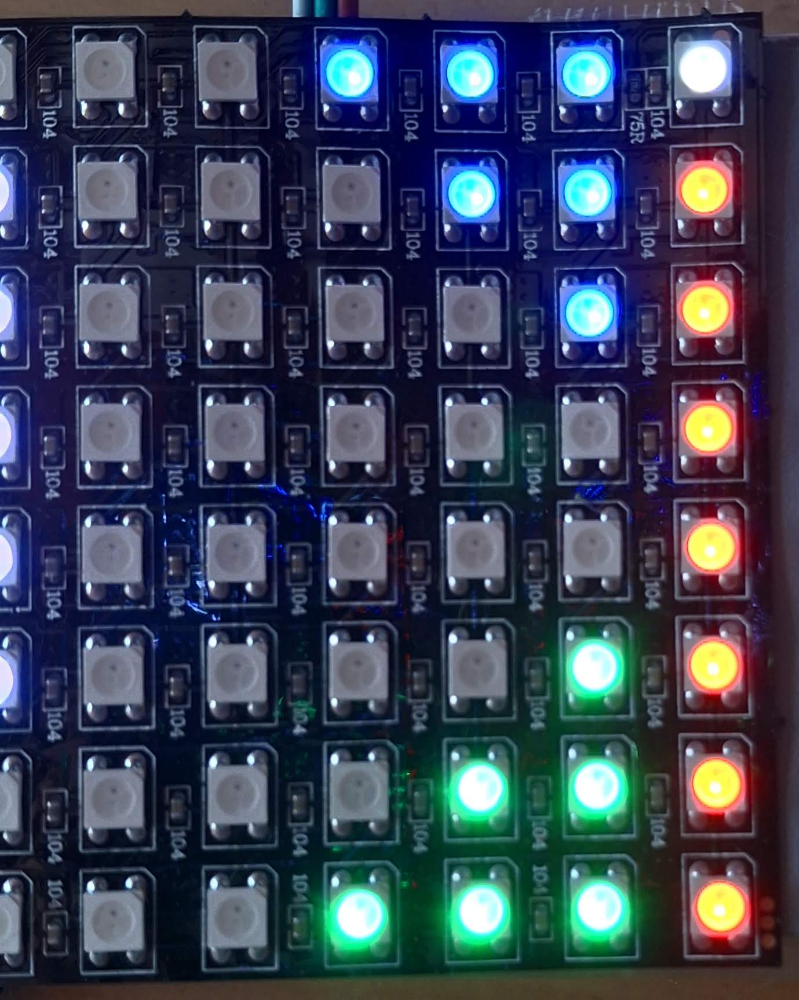
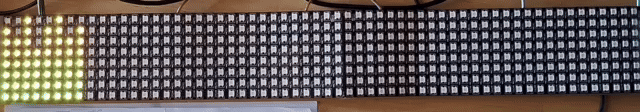
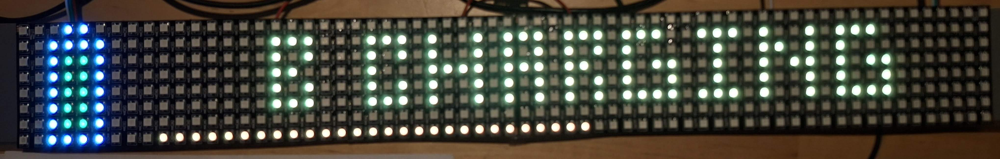
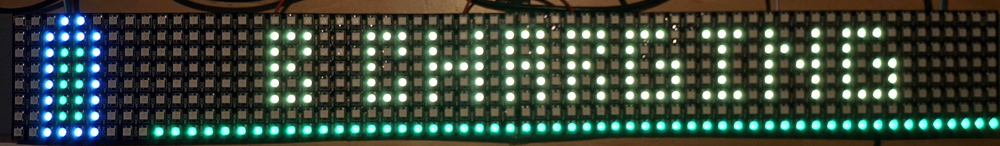
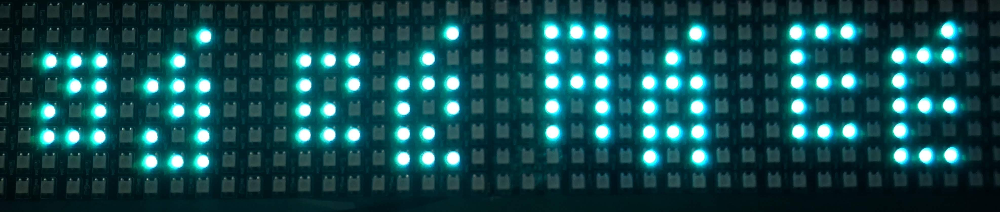

# EspHoMatrix-64x8
## Modified version of the [EspHoMaTriXv2](https://github.com/lubeda/EspHoMaTriXv2) library, specifically designed for **64x8 pixel LED matrices** (like Ulanzi TC001 custom mods or DIY panels).

WARNING! THIS IS A BETA VERSION, BUGS MAY OCCUR. I WILL FIX THEM AS I CAN, BUT I DO NOT WORK ON THE CODE CONSTANTLY.

I tested the repo and it works.

## What everyone needs to set up for themselves:

```yaml
# Enable OTA
ota:
  - platform: esphome
    password: !secret ota_password
 
# WI-FI setup
wifi:
  networks:
  - ssid: !secret wifi_ssid_1
    password: !secret wifi_password
  - ssid: !secret wifi_ssid_2
    password: !secret wifi_password

  manual_ip:  #if you want
    static_ip: 192.168.xxx.xxx
    gateway: 192.168.xxx.xxx
    subnet: 255.255.255.0
    dns1: 8.8.8.8    #if you want
    dns2: 8.8.4.4    #if you want

```
The latest EspHome version and ESP-IDF are used today. 2026.01.02.

I am Hungarian, there are Hungarian language parts in the repo.

I will have this display on top of my kitchen cabinet. That's why I don't have any buttons. There's nothing else but the display and a photoresistor for automatic brightness adjustment.

I use an LED matrix like this.


Here is the wiring diagram. Use a good, reliable power supply! I don't use the brightness at 100%. I haven't measured how much current it draws yet.



## NEW FEATURES:

- INCREASED DISPLAY SIZE 8X64
- MODE_ICON_DATE_TIME

This is the new ICON_DATE_TIME screen. This is the default for me.



If there is no individual information, then this is what is displayed basically. Date/time, indoor temperature/humidity, weather, outdoor temperature, outdoor humidity, and wind.


## MODIFICATIONS:

- MOVE GAUGE TO RIGHT SIDE
- MOVE THE R INDICATORS BEFORE THE GAUGE. SIZE 1-3

The GAUGE has moved to the right edge. It does not interfere with the text, icons or indicators. The indicators will appear in front of the gauge.
All indicators (that I left) are enabled. The rightmost indicators do not interfere with the text display at all.



- DISABLE FIRE SCREEN
- I CHANGED THE SCREEN TIME CALCULATION IN ICON TEXT SCREEN AND RAINBOW ICON TEXT SCREEN MODE

## REMOVED ITEMS:

- MODE_BITMAP_SCREEN
- MODE_BITMAP_STACK_SCREEN
- MODE_BITMAP_SMALL
- MODE_RAINBOW_BITMAP_SMALL
- RAINBOW_CLOCK
- RAINBOW_DATE
- COLOR_GAUGE
- RCINDICATOR
- LCINDICATOR
- ICINDICATOR
- GRAPH_SCREEN
- FIRE SCREEN

## Some examples:

## Normal text_screen.
There is only text here.


## Icon_screen.
Icon+text. For longer text, the icon remains in place even if you have to scroll. It is always visible.
The only difference between icon_screen and icon_text_screen is that in icon_text_screen, when the text reaches the icon, the icon is flipped (disappears)




## Text_screen_progress.
Icon+text+progress bar. For example, we can display battery charge or some other process.





## Alert_screen.
Icon+text. This will appear immediately. Display important messages. For example, ringing, things like that.


I have implemented many icons in the EspHome yaml file. You can delete or add other icons at any time. You can find the icons here: https://developer.lametric.com/icons

I also included some fonts. My favorite is the MatrixChunky fonts. I am Hungarian. English letters are fine, but you would not believe how long it took to find normal accented letters. The accented letters are shifted.



I'm not a programmer, just an enthusiastic amateur. :) If you have any ideas on how to improve this project, please let me know.

## Original library by LuBeDa. https://github.com/lubeda/EspHoMaTriXv2

Modified by [hollosipeti].
